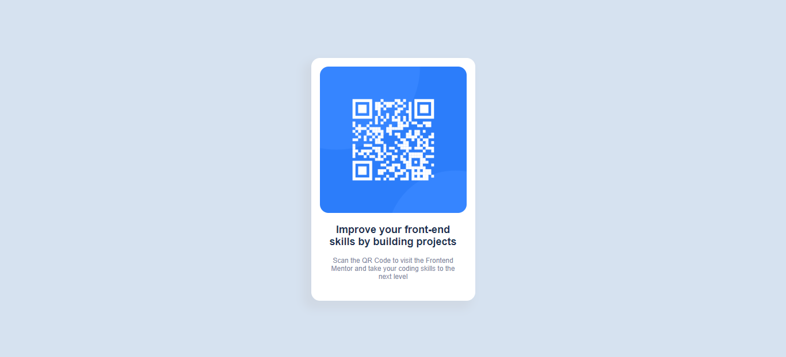

# Frontend Mentor - QR code component solution

This is a solution to the [QR code component challenge on Frontend Mentor](https://www.frontendmentor.io/challenges/qr-code-component-iux_sIO_H). Frontend Mentor challenges help you improve your coding skills by building realistic projects. 

## Table of contents

- [Overview](#overview)
  - [Screenshot](#screenshot)
  - [Links](#links)
- [My process](#my-process)
  - [Built with](#built-with)
  - [What I learned](#what-i-learned)
  - [Continued development](#continued-development)

## Overview

### Screenshot

### Links

- Solution URL: [solution URL here](https://github.com/ssuish/qrcode_component_fe)
- Live Site URL: [live site URL here](https://qrcode-component-fm-ssuish.netlify.app/)

## My process

### Built with

- Semantic HTML5 markup
- CSS custom properties
- Flexbox

### What I learned

I learned how to use proper css properties to center the div in the middle of the screen with the help of css flexbox. 

### Continued development

I want to focus more on fundamental css styling and understand in-depth the box model and flexbox behaviors. 
